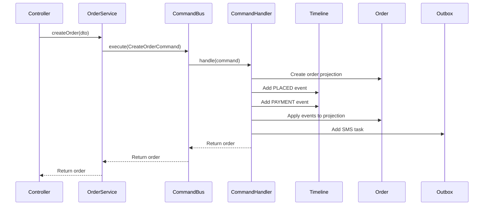

<!-- 1fbd72c2-7880-46d6-b193-a674c6e8c267 7af2ad30-894e-42e3-8bab-a8b896da7e06 -->
# Order Workflow Enhancement with Configurable SMS

## Overview

Enhance the order system to support:

1. **Counter Payment Workflow** - In-store/physical orders with immediate payment and 7-minute delayed SMS
2. **Online Order Workflow** - Automated e-commerce funnel with status transitions and auto-delivery
3. **Configurable SMS System** - Admin-managed SMS templates with placeholders, trigger events, and customizable send counts

## Key Features

### 1. Order Type & Discount System

- Add `OrderType` enum (COUNTER, ONLINE)
- Add order-level discount fields: `orderDiscount` (amount), `voucherCode` (string)
- Update total calculation to include order-level discounts

### 2. Driver Information Tracking

- Add optional shipping fields: `driverName`, `driverPhone`, `vehicleNumber`
- Include driver info in SHIPPED status SMS when available

### 3. Feedback Token System

- Generate unique feedback token (UUID) when order is DELIVERED
- Store `feedbackToken` in order entity (unique, indexed)
- Create feedback link format: `{FRONTEND_URL}/feedback/{feedbackToken}`
- Include feedback link in delivery SMS via placeholder

### 4. Configurable SMS Template System

- SMS Template entity to store admin-configured messages
- Placeholder system: `{{customerName}}`, `{{orderNumber}}`, `{{totalAmount}}`, etc.
- Trigger event system: Define which status transitions trigger SMS
- Multiple SMS support: Configure number of SMS messages per trigger (1-5)
- Send delay: Configure delay in minutes (e.g., 7 minutes for counter receipts)
- Order type filtering: Apply templates to COUNTER, ONLINE, or both
- Priority system: Multiple templates per trigger execute in priority order

### 5. Scheduled Tasks

- **Delayed SMS Service**: Queue SMS based on template `sendDelay` configuration
- **Auto-Delivery Cron**: Daily at 9:00 PM (21:00), auto-mark SHIPPED orders as DELIVERED (48+ hours old)

## Implementation Details

### Entity Changes

**`src/modules/order/entities/order.entity.ts`**

- Add `OrderType` enum: `COUNTER = 'COUNTER'`, `ONLINE = 'ONLINE'`
- Add `orderType: OrderType` field (default: ONLINE)
- Add `orderDiscount: number` field (default: 0)
- Add `voucherCode: string` field (optional)
- Add `driverName: string` field (optional)
- Add `driverPhone: string` field (optional)
- Add `vehicleNumber: string` field (optional)
- Add `feedbackToken: string` field (optional, unique, indexed)
- Add `delayedSmsSent: boolean` field (default: false)

**`src/modules/order/entities/sms-template.entity.ts`** (new)

- `id`: Primary key
- `name`: Template name (e.g., "Order Confirmation - Online")
- `triggerEvent`: Enum - status transition trigger (see Trigger Events below)
- `message`: Template text with placeholders (e.g., "Hi {{customerName}}, Order {{orderNumber}} confirmed!")
- `isActive`: boolean - enable/disable template
- `sendCount`: number - how many SMS to send (default: 1, max: 5)
- `sendDelay`: number - delay in minutes before sending (optional, 0 = immediate)
- `orderType`: OrderType enum (COUNTER, ONLINE, or null for both)
- `priority`: number - order of execution if multiple templates (lower = first)
- `createdAt`, `updatedAt`: timestamps

### Trigger Events Enum

- `ORDER_PLACED` - When order is first created
- `PLACED_TO_CONFIRMED` - Payment status: PENDING → PAID
- `CONFIRMED_TO_PROCESSING` - Fulfillment: CONFIRMED → PROCESSING
- `PROCESSING_TO_PACKAGING` - Fulfillment: PROCESSING → PACKAGING
- `PACKAGING_TO_SHIPPED` - Fulfillment: PACKAGING → SHIPPED
- `SHIPPED_TO_DELIVERED` - Fulfillment: SHIPPED → DELIVERED
- `ORDER_CANCELED` - When order is canceled
- `PAYMENT_FAILED` - Payment status: PAID → FAILED
- `COUNTER_PAYMENT_RECEIPT` - Special trigger for counter payment (with delay)

### Placeholder System

Supported placeholders in message templates:

- `{{customerName}}` - Customer's name
- `{{customerPhone}}` - Customer's phone number
- `{{customerEmail}}` - Customer's email
- `{{orderNumber}}` - Order number (e.g., #100234)
- `{{orderId}}` - Order ID
- `{{orderDate}}` - Order date (formatted)
- `{{totalAmount}}` - Total order amount
- `{{orderDiscount}}` - Discount amount
- `{{subtotal}}` - Subtotal before discount
- `{{paymentMethod}}` - Payment method (Cash, mBoB, etc.)
- `{{fulfillmentStatus}}` - Current fulfillment status
- `{{paymentStatus}}` - Current payment status
- `{{driverName}}` - Driver name (if available)
- `{{driverPhone}}` - Driver phone (if available)
- `{{vehicleNumber}}` - Vehicle number (if available)
- `{{shippingCost}}` - Shipping cost
- `{{feedbackLink}}` - Feedback link (for delivered orders)
- `{{supportPhone}}` - Support phone number (from company config)
- `{{trackingLink}}` - Order tracking link

### DTO Changes

**`src/modules/order/dto/create-order.dto.ts`**

- Add `orderType?: OrderType` field
- Add `orderDiscount?: number` field
- Add `voucherCode?: string` field

**`src/modules/order/dto/update-fulfillment-status.dto.ts`**

- Add optional driver fields: `driverName?`, `driverPhone?`, `vehicleNumber?`

**`src/modules/order/dto/create-sms-template.dto.ts`** (new)

- `name`: string (required)
- `triggerEvent`: enum (required)
- `message`: string (required)
- `isActive`: boolean (default: true)
- `sendCount`: number (default: 1, min: 1, max: 5)
- `sendDelay`: number (optional, minutes, default: 0)
- `orderType`: OrderType enum (optional, null = both)
- `priority`: number (default: 0)

**`src/modules/order/dto/update-sms-template.dto.ts`** (new)

- Extends PartialType(CreateSmsTemplateDto)

**`src/modules/order/dto/sms-template-response.dto.ts`** (new)

- Full template with ID, timestamps

**`src/modules/order/dto/test-sms-template.dto.ts`** (new)

- `orderId`: number - Use existing order data for testing

### CQRS Implementation (NestJS @nestjs/cqrs)

**Installation Required:**
```bash
npm install --save @nestjs/cqrs
```

**CQRS Structure:**
- **Commands**: Write operations (CreateOrderCommand, ShipOrderCommand, UpdatePaymentStatusCommand)
- **Queries**: Read operations (GetOrderQuery, GetOrderTimelineQuery, GetOrderHistoryQuery)
- **Command Handlers**: Handle commands, update state, emit events
- **Query Handlers**: Handle queries, return read-optimized data
- **Event Bus**: For domain events (optional, for decoupled communication)

### Command Structure

**Commands (Write Operations):**

**`src/modules/order/commands/create-order.command.ts`** (new)
```typescript
export class CreateOrderCommand {
  constructor(
    public readonly customerDetails: CustomerDetailsDto,
    public readonly orderLineItems: CreateOrderLineItemDto[],
    public readonly orderType: OrderType,
    public readonly paymentMethod?: PaymentMethod,
    public readonly orderDiscount?: number,
    public readonly voucherCode?: string,
  ) {}
}
```

**`src/modules/order/commands/ship-order.command.ts`** (new)
```typescript
export class ShipOrderCommand {
  constructor(
    public readonly orderId: number,
    public readonly driverName?: string,
    public readonly driverPhone?: string,
    public readonly vehicleNumber?: string,
    public readonly userId?: number,
  ) {}
}
```

**`src/modules/order/commands/update-payment-status.command.ts`** (new)
```typescript
export class UpdatePaymentStatusCommand {
  constructor(
    public readonly orderId: number,
    public readonly paymentStatus: PaymentStatus,
    public readonly paymentMethod?: PaymentMethod,
    public readonly transactionId?: string,
  ) {}
}
```

**`src/modules/order/commands/update-fulfillment-status.command.ts`** (new)
```typescript
export class UpdateFulfillmentStatusCommand {
  constructor(
    public readonly orderId: number,
    public readonly fulfillmentStatus: FulfillmentStatus,
    public readonly userId?: number,
  ) {}
}
```

**`src/modules/order/commands/mark-delivered.command.ts`** (new)
```typescript
export class MarkDeliveredCommand {
  constructor(
    public readonly orderId: number,
    public readonly userId?: number,
  ) {}
}
```

### Query Structure

**Queries (Read Operations):**

**`src/modules/order/queries/get-order.query.ts`** (new)
```typescript
export class GetOrderQuery {
  constructor(public readonly orderId: number) {}
}
```

**`src/modules/order/queries/get-order-timeline.query.ts`** (new)
```typescript
export class GetOrderTimelineQuery {
  constructor(public readonly orderId: number) {}
}
```

**`src/modules/order/queries/get-order-history.query.ts`** (new)
```typescript
export class GetOrderHistoryQuery {
  constructor(public readonly orderId: number) {}
}
```

**`src/modules/order/queries/find-orders.query.ts`** (new)
```typescript
export class FindOrdersQuery {
  constructor(public readonly queryDto: OrderQueryDto) {}
}
```

### Command Handlers

**`src/modules/order/handlers/create-order.handler.ts`** (new)
```typescript
@CommandHandler(CreateOrderCommand)
export class CreateOrderHandler implements ICommandHandler<CreateOrderCommand> {
  constructor(
    @InjectModel(Order) private orderModel: typeof Order,
    @InjectModel(OrderTimeline) private timelineModel: typeof OrderTimeline,
    @InjectModel(Outbox) private outboxModel: typeof Outbox,
    private customerService: CustomerService,
    private idempotencyService: IdempotencyService,
  ) {}

  async execute(command: CreateOrderCommand): Promise<Order> {
    // Business logic for order creation
    // 1. Find/create customer
    // 2. Calculate totals with discounts
    // 3. Create order projection
    // 4. Add timeline events (PLACED, PAYMENT status)
    // 5. Apply events to projection
    // 6. Add SMS task to outbox
    // All in transaction
  }
}
```

**`src/modules/order/handlers/ship-order.handler.ts`** (new)
```typescript
@CommandHandler(ShipOrderCommand)
export class ShipOrderHandler implements ICommandHandler<ShipOrderCommand> {
  constructor(
    @InjectModel(Order) private orderModel: typeof Order,
    @InjectModel(OrderTimeline) private timelineModel: typeof OrderTimeline,
    @InjectModel(Outbox) private outboxModel: typeof Outbox,
  ) {}

  async execute(command: ShipOrderCommand): Promise<Order> {
    // 1. Validate order exists and is in PACKAGING state
    // 2. Add SHIPPED timeline event with driver metadata
    // 3. Apply event to order projection
    // 4. Add SMS task to outbox (with driver info)
  }
}
```

**`src/modules/order/handlers/update-payment-status.handler.ts`** (new)
```typescript
@CommandHandler(UpdatePaymentStatusCommand)
export class UpdatePaymentStatusHandler implements ICommandHandler<UpdatePaymentStatusCommand> {
  // Handle payment status changes
  // Add PAYMENT timeline events
  // Update order projection
  // Trigger SMS if needed (via outbox)
}
```

### Query Handlers

**`src/modules/order/handlers/get-order.handler.ts`** (new)
```typescript
@QueryHandler(GetOrderQuery)
export class GetOrderHandler implements IQueryHandler<GetOrderQuery> {
  constructor(
    @InjectModel(Order) private orderModel: typeof Order,
  ) {}

  async execute(query: GetOrderQuery): Promise<Order> {
    // Read-optimized query
    // Return order with relations (customer, line items, timeline)
  }
}
```

**`src/modules/order/handlers/get-order-timeline.handler.ts`** (new)
```typescript
@QueryHandler(GetOrderTimelineQuery)
export class GetOrderTimelineHandler implements IQueryHandler<GetOrderTimelineQuery> {
  constructor(
    @InjectModel(OrderTimeline) private timelineModel: typeof OrderTimeline,
  ) {}

  async execute(query: GetOrderTimelineQuery): Promise<OrderTimeline[]> {
    // Return timeline events ordered by timestamp
  }
}
```

### Service Layer (Refactored)

**`src/modules/order/order.service.ts`** (Refactored - Facade Pattern)

The service becomes a facade that uses CommandBus and QueryBus:

```typescript
@Injectable()
export class OrderService {
  constructor(
    private readonly commandBus: CommandBus,
    private readonly queryBus: QueryBus,
  ) {}

  async createOrder(createOrderDto: CreateOrderDto): Promise<Order> {
    const command = new CreateOrderCommand(
      createOrderDto.customer,
      createOrderDto.orderLineItems,
      createOrderDto.orderType || 'ONLINE',
      createOrderDto.paymentMethod,
      createOrderDto.orderDiscount,
      createOrderDto.voucherCode,
    );
    return this.commandBus.execute(command);
  }

  async findOneOrder(id: number): Promise<Order> {
    const query = new GetOrderQuery(id);
    return this.queryBus.execute(query);
  }

  async shipOrder(orderId: number, driverInfo: ShipOrderDto): Promise<Order> {
    const command = new ShipOrderCommand(
      orderId,
      driverInfo.driverName,
      driverInfo.driverPhone,
      driverInfo.vehicleNumber,
    );
    return this.commandBus.execute(command);
  }
}
```

### SMS Template Services

**`src/modules/order/sms-template.service.ts`** (new)

- CRUD operations for SMS templates
- `findActiveTemplatesByTrigger(triggerEvent, orderType)`: Get active templates for a trigger
- `renderTemplate(template, order)`: Replace placeholders with actual order data
- `getPlaceholderValue(order, placeholder)`: Extract value for a placeholder
- `getAvailablePlaceholders()`: Return list of all supported placeholders with descriptions
- `getAvailableTriggers()`: Return list of all trigger events

**`src/modules/order/sms-trigger.service.ts`** (new)

- `getTriggerEvent(oldFulfillmentStatus, newFulfillmentStatus, oldPaymentStatus?, newPaymentStatus?)`: Determine trigger event
- `processSmsTemplates(order, triggerEvent)`: Find and process all templates for a trigger
- `sendSmsForTrigger(order, triggerEvent)`: Main method to send SMS when status changes (used by outbox processor)
- `sendMultipleSms(order, template, sendCount)`: Send multiple SMS if sendCount > 1

### Scheduled Services

**`src/modules/order/order-scheduler.service.ts`** (new)

- `@Cron('0 21 * * *')` - Daily at 9:00 PM
- Find all orders with status SHIPPED where `shippedAt` is 48+ hours ago
- Auto-update to DELIVERED status
- Generate feedback tokens and trigger delivery SMS via SmsTriggerService

**`src/modules/order/delayed-sms.service.ts`** (new)

- Queue system for delayed SMS based on template `sendDelay` configuration
- Uses setTimeout or scheduled task to send SMS after specified delay
- Works with SMS template system - respects template delay settings
- Store pending delayed SMS in memory/database (optional persistence)

### Admin API Endpoints

**`src/modules/order/sms-template.controller.ts`** (new)

- `POST /orders/sms-templates` - Create SMS template
- `GET /orders/sms-templates` - List all templates (with filters: triggerEvent, orderType, isActive)
- `GET /orders/sms-templates/:id` - Get template by ID
- `PATCH /orders/sms-templates/:id` - Update template
- `DELETE /orders/sms-templates/:id` - Delete template
- `POST /orders/sms-templates/:id/test` - Test template with sample order data
- `GET /orders/sms-templates/triggers` - Get list of available trigger events
- `GET /orders/sms-templates/placeholders` - Get list of available placeholders with descriptions

### SMS Message Formatting

**`src/modules/external/sms/sms-message.formatter.ts`**

- Add `renderTemplateWithPlaceholders(template, order)`: Render template with placeholder replacement
- Keep legacy methods for backward compatibility (fallback if no templates configured)
- `validatePlaceholder(placeholder)`: Validate placeholder syntax

### Module Updates

**`src/modules/order/order.module.ts`**

```typescript
import { CqrsModule } from '@nestjs/cqrs';

@Module({
  imports: [
    SequelizeModule.forFeature([
      Order,
      OrderLineItem,
      Customer,
      OrderTimeline,
      Outbox,
      SmsTemplate,
      Product,
    ]),
    CqrsModule, // NestJS CQRS module
    ScheduleModule.forRoot(),
    AccountsModule,
    CustomerModule,
    SmsModule,
  ],
  controllers: [OrderController, SmsTemplateController],
  providers: [
    // CQRS Infrastructure
    CommandBus,
    QueryBus,
    EventBus,
    
    // Command Handlers
    CreateOrderHandler,
    ShipOrderHandler,
    UpdatePaymentStatusHandler,
    UpdateFulfillmentStatusHandler,
    MarkDeliveredHandler,
    
    // Query Handlers
    GetOrderHandler,
    GetOrderTimelineHandler,
    GetOrderHistoryHandler,
    FindOrdersHandler,
    
    // Services (Facades)
    OrderService,
    
    // Supporting Services
    OrderTimelineService,
    OutboxService,
    OutboxProcessorService,
    IdempotencyService,
    CircuitBreakerService,
    SmsTemplateService,
    SmsTriggerService,
    
    // Scheduled Services
    OrderSchedulerService,
  ],
  exports: [OrderService, CqrsModule],
})
export class OrderModule implements OnModuleInit {
  constructor(
    private readonly commandBus: CommandBus,
    private readonly queryBus: QueryBus,
  ) {}

  onModuleInit() {
    // Register all command handlers
    this.commandBus.register([
      CreateOrderHandler,
      ShipOrderHandler,
      UpdatePaymentStatusHandler,
      UpdateFulfillmentStatusHandler,
      MarkDeliveredHandler,
    ]);

    // Register all query handlers
    this.queryBus.register([
      GetOrderHandler,
      GetOrderTimelineHandler,
      GetOrderHistoryHandler,
      FindOrdersHandler,
    ]);
  }
}
```

### Workflow Logic

**Counter Payment Flow:**

1. Order created with `orderType: COUNTER`
2. Payment marked as PAID immediately
3. Trigger `COUNTER_PAYMENT_RECEIPT` event
4. SMS templates with delay (7 minutes) are scheduled automatically
5. Receipt SMS sent after delay using configured template

**Online Order Flow:**

1. Order created with `orderType: ONLINE`, status: PLACED, payment: PENDING
2. Trigger `ORDER_PLACED` event (SMS sent if template configured)
3. Payment verified → status: CONFIRMED, payment: PAID → Trigger `PLACED_TO_CONFIRMED` → SMS sent
4. Status → PROCESSING → Trigger `CONFIRMED_TO_PROCESSING` → SMS sent (if template exists)
5. Status → SHIPPED (with optional driver info) → Trigger `PACKAGING_TO_SHIPPED` → SMS with driver details
6. Auto-delivery after 48 hours → Status: DELIVERED → Trigger `SHIPPED_TO_DELIVERED` → SMS with feedback link

## Files to Create/Modify

### New Files - CQRS Commands

- `src/modules/order/commands/create-order.command.ts`
- `src/modules/order/commands/ship-order.command.ts`
- `src/modules/order/commands/update-payment-status.command.ts`
- `src/modules/order/commands/update-fulfillment-status.command.ts`
- `src/modules/order/commands/mark-delivered.command.ts`

### New Files - CQRS Queries

- `src/modules/order/queries/get-order.query.ts`
- `src/modules/order/queries/get-order-timeline.query.ts`
- `src/modules/order/queries/get-order-history.query.ts`
- `src/modules/order/queries/find-orders.query.ts`

### New Files - CQRS Handlers

- `src/modules/order/handlers/create-order.handler.ts`
- `src/modules/order/handlers/ship-order.handler.ts`
- `src/modules/order/handlers/update-payment-status.handler.ts`
- `src/modules/order/handlers/update-fulfillment-status.handler.ts`
- `src/modules/order/handlers/mark-delivered.handler.ts`
- `src/modules/order/handlers/get-order.handler.ts`
- `src/modules/order/handlers/get-order-timeline.handler.ts`
- `src/modules/order/handlers/get-order-history.handler.ts`
- `src/modules/order/handlers/find-orders.handler.ts`

### New Files - Core Services

- `src/modules/order/entities/order-timeline.entity.ts` - Event store entity
- `src/modules/order/entities/outbox.entity.ts` - Transactional outbox entity
- `src/modules/order/order-timeline.service.ts` - Timeline operations
- `src/modules/order/outbox.service.ts` - Outbox management
- `src/modules/order/outbox-processor.service.ts` - Outbox consumer
- `src/modules/order/idempotency.service.ts` - Idempotency layer
- `src/modules/order/circuit-breaker.service.ts` - Circuit breaker for external services

### New Files - SMS System

- `src/modules/order/entities/sms-template.entity.ts` - SMS template entity
- `src/modules/order/sms-template.service.ts` - SMS template CRUD and rendering
- `src/modules/order/sms-trigger.service.ts` - SMS trigger processing
- `src/modules/order/sms-template.controller.ts` - Admin API for templates
- `src/modules/order/dto/create-sms-template.dto.ts`
- `src/modules/order/dto/update-sms-template.dto.ts`
- `src/modules/order/dto/sms-template-response.dto.ts`
- `src/modules/order/dto/test-sms-template.dto.ts`

### New Files - Scheduled Tasks

- `src/modules/order/order-scheduler.service.ts` - Auto-delivery cron job (queries timeline)

### New Files - DTOs

- `src/modules/order/dto/update-shipping.dto.ts` - Shipping with driver info

### Modified Files

- `src/modules/order/entities/order.entity.ts` - Add new fields, remove redundant timestamps, add timeline relationship
- `src/modules/order/dto/create-order.dto.ts` - Add order type and discount fields
- `src/modules/order/order.service.ts` - Refactor to use CommandBus and QueryBus (facade pattern)
- `src/modules/order/order.controller.ts` - Update endpoints to use OrderService (which uses CQRS internally)
- `src/modules/order/order.module.ts` - Import CqrsModule, register all handlers, register all services
- `src/modules/external/sms/sms-message.formatter.ts` - Add template rendering support

### Package Installation

```bash
npm install --save @nestjs/cqrs
```

## CQRS Flow Diagram



**Benefits of NestJS CQRS:**
- Separation of concerns: Commands for writes, Queries for reads
- Independent scaling: Read and write paths can scale separately
- Testability: Handlers can be tested in isolation
- Flexibility: Can optimize read and write models independently
- Type safety: Commands and queries are strongly typed

## Admin Configuration Workflow

1. Admin navigates to SMS Templates section in admin panel
2. Views available trigger events and placeholders
3. Creates new template with:

- Name (e.g., "Order Confirmation - Online")
- Trigger Event (e.g., PLACED_TO_CONFIRMED)
- Message with placeholders (e.g., "Hi {{customerName}}, Order {{orderNumber}} confirmed! Amount: Nu. {{totalAmount}}")
- Send count (e.g., 3 - sends 3 SMS)
- Delay (optional, e.g., 7 minutes for counter orders)
- Order type filter (COUNTER, ONLINE, or both)
- Priority (if multiple templates for same trigger)

4. Tests template with sample order data
5. Activates template
6. System automatically uses templates when matching triggers occur (via outbox processor)
7. Multiple templates per trigger are supported (sent in priority order)